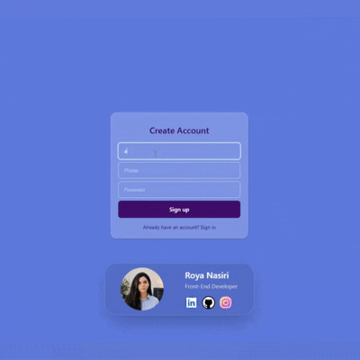

# 🔐 Signup CRUD System

A responsive authentication system built with **HTML**, **CSS (Tailwind CSS)** and **Vanilla JavaScript**. This project demonstrates a complete user authentication workflow using **MockAPI** as a fake REST API.

Demo : https://roya-nasiri.github.io/Signup-crud/



## ✨ Features

* ✅ User Registration (Sign Up)
* ✅ User Login (Sign In)
* ✅ Password Validation

  * Minimum 8 characters
  * At least one uppercase letter
  * At least one lowercase letter
  * At least one number
  * At least one special character
* ✅ Remember Me (Local Storage)
* ✅ Auto Login
* ✅ Edit User Information
* ✅ Delete User
* ✅ Responsive UI
* ✅ Custom Error Messages
* ✅ Glassmorphism Design

---

## 🛠️ Technologies Used

* HTML5
* CSS3
* Tailwind CSS
* JavaScript (ES6+)
* Fetch API
* Local Storage
* MockAPI

---

## 📷 Preview


> Replace **preview.png** with your project screenshot.

---

## 📂 Project Structure

```
📦 Signup-crud
├── src
│   ├── css
│   ├── img
│   ├── js
│   │   └── app.js
│   └── stylesheet
├── index.html
└── README.md
```

---

## 🚀 Getting Started

Clone the repository:

```bash
git clone https://github.com/Roya-Nasiri/Signup-crud.git
```

Open the project:

```bash
cd Signup-crud
```

Then simply open **index.html** in your browser.

---

## 🔗 API

This project uses **MockAPI** to simulate backend CRUD operations.

Supported operations:

* Create User
* Read Users
* Update User
* Delete User

---

## 📌 Future Improvements

* Email Validation
* Forgot Password
* Password Encryption
* JWT Authentication
* Profile Image Upload
* Dark Mode
* Backend Integration (Node.js / Express / MongoDB)

---

## 👩‍💻 Author

**Roya Nasiri**

Frontend Developer

* GitHub: https://github.com/Roya-Nasiri
* LinkedIn: https://www.linkedin.com/in/roya-nasiri-81466123a

---

## ⭐ If you like this project
Give this repository a ⭐ on GitHub.
